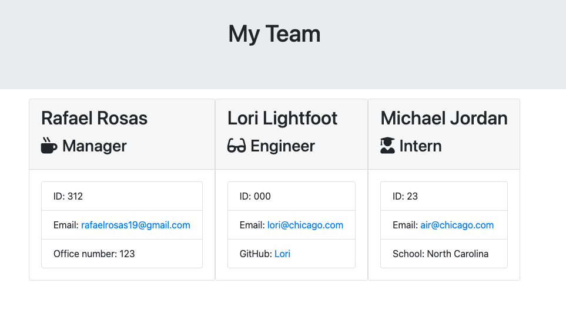

# Team-Builder

## Description

This is a Node CLI application that uses the Inquirer and Jest packages. The goal of this application is to allow a user to create a webpage that lists all of their employee's relevant information for quick access. This includes whether an employee is either a manager, engineer, or intern. The webpage will also list information that is specific to the employee's role such as office number, github username, or school. 

## Installation

To install this respository you will need Node, Inquirer, and Jest installed on your local machine using npm install. 

https://rafaelrosas19.github.io/

## Usage

To run the application make sure that you are in the Develop directory and use your integrated terminal to type `node app.js`. The terminal will ask a series of questions to the user in order to find out whether the employee is a manager, engineer, or intern. The application will push the information to an array of Employees. This array will be rendered using an `htmlRenderer.js` and create the final `team.html` file which will display all of the information.

## Credits 

I would like to give credit to my TA for reviewing constructor functions. I would also like to thank my classmates for helping me with this assignment. 

### Things I learned

1. One of the most important things I learned from this assignment was the use of classes instead of constructor functions. Furthermore, how to use a superclass and subclass to create new classes. 
2. Another thing that I was able to work on was Inquirer and validating user inputs. 
3. Jest.
